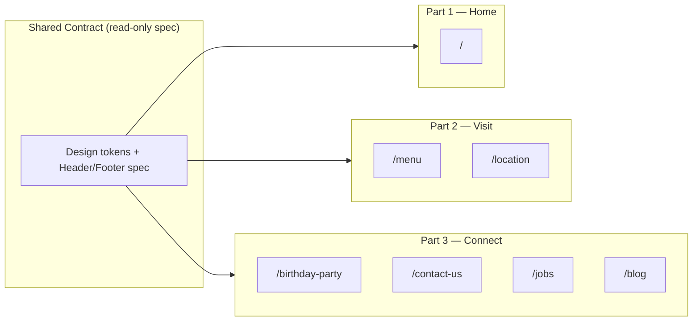

# Restaurant Website Plan

> Reference: [Eclipse di Luna](https://www.eclipsediluna.com/) layout and visual style  
> Restaurant: **SAIGON DISTRICT KITCHEN AND BAR** — single location, Vietnamese, **English only**  
> No emoji or decorative icons; match the reference site's typography, spacing, and section structure.

---

## Restaurant Info

| Field | Content |
|-------|---------|
| Name | SAIGON DISTRICT KITCHEN AND BAR |
| Address | 4500 Satellite Blvd #1180, Duluth, GA 30096 |
| Phone | (678) 404-7383 |
| Email | parisbanhmiatl.info@gmail.com |
| Cuisine | Vietnamese |
| Reviews | 3/5 (12 reviews) — optional display |
| Hours | Open · Closes 11 PM (full weekly schedule TBD) |

---

## Scope Summary

| Removed | Kept |
|---------|------|
| Reservations, Catering, Newsletter, Order Online, Deals, branch selectors, detailed menu categories | Gift Card, Menu (PDF), Location, Entertainment, Birthday Party, Contact, Jobs, Blog, Reviews, Instagram |

---

## Parallel Work Model (3 Independent Parts)

The site is split into **3 isolated work packages**. Each package owns its own folder, pages, and assets. Different agents can work on different parts **at the same time** without editing each other's files.



### Folder layout

```
restaurant website/
├── PLAN.md
├── PART-1-HOME.md
├── PART-2-VISIT.md
├── PART-3-CONNECT.md
├── shared/                              ← site-wide (logo lives here)
│   ├── assets/
│   │   └── brand/
│   │       └── logo.jpg
│   ├── styles/tokens.css
│   └── components/Header.*, Footer.*, GiftCardModal.*
├── part-1-home/                         ← Part 1 only
│   └── assets/
│       └── hero/
│           └── hero-background.jpg
├── part-2-visit/                        ← Part 2 only
│   └── assets/
│       └── menu/
│           └── menu.pdf                 ← moved from root
└── part-3-connect/                      ← Part 3 only
    └── assets/                          ← placeholders until real photos added
        ├── birthday/
        └── blog/
```

### Available assets (provided)

| Original file | Canonical path | Used on |
|---------------|----------------|---------|
| `logo.jpg` | `shared/assets/brand/logo.jpg` | Header on every page |
| `background.jpg` | `part-1-home/assets/hero/hero-background.jpg` | Home hero (full-bleed static image; reference site uses video — same layout, image instead) |
| `Saigon menu  2.pdf` | `part-2-visit/assets/menu/menu.pdf` | `/menu` embed + download |

**Root rule:** only plan/docs folders at root — **no loose image or PDF files**.

### One-time asset setup

```text
shared/assets/brand/logo.jpg              ← from root logo.jpg
part-1-home/assets/hero/hero-background.jpg  ← from root background.jpg
part-2-visit/assets/menu/menu.pdf         ← from root Saigon menu  2.pdf
```

All parts may **read** `shared/assets/brand/logo.jpg` for the header. Do not duplicate the logo into each part folder.

### Rules for all parts

1. **Do not edit files outside your part folder** during parallel work.
2. **Follow the Shared Contract** below for nav links, colors, fonts, header/footer markup.
3. Each part must be **previewable on its own** (standalone HTML or a local dev route scoped to that part).
4. Use **placeholder copy and placeholder images** where content is TBD.
5. **English only.** No newsletter, no order online, no deals, no reservations, no catering.
6. **Integration** (merge shared shell + wire routes) happens after all 3 parts are done — not during parallel work.

---

## Shared Contract (all 3 parts must match)

Every part wraps its page content in the same shell. Copy this structure exactly; only the `<main>` content differs per page.

### Design tokens

| Token | Value (adjust at integration if needed) |
|-------|------------------------------------------|
| Primary background | Dark (reference site hero style) |
| Body font | Sans-serif (clean, modern) |
| Heading font | Serif or display serif (reference site feel) |
| Accent | Warm gold or terracotta (reference site CTA tone) |
| Max content width | ~1200px |
| Section vertical padding | ~80–120px |

### Header

- Logo image: `shared/assets/brand/logo.jpg` (alt: `SAIGON DISTRICT KITCHEN AND BAR`)
- Nav links: `Menu` → `/menu` · `Location` → `/location` · `Birthday Party` → `/birthday-party` · `Contact` → `/contact-us` · `Blog` → `/blog`
- One CTA button: **Gift Card** (opens modal or external link)

### Gift Card modal

- Title: *A Gift Everyone Will Enjoy*
- Short copy + **Buy a Gift Card** button
- Link: `#` placeholder until gift card URL is provided

### Footer

- Column **Our Restaurant:** Menu · Entertainment · Gift Card
- Column **More:** Birthday Party · Jobs · Blog · Contact Us
- Bottom line: address, phone, parisbanhmiatl.info@gmail.com, copyright

### Nav link map (fixed — do not invent new routes)

| Label | Path |
|-------|------|
| Home | `/` |
| Menu | `/menu` |
| Location | `/location` |
| Birthday Party | `/birthday-party` |
| Contact | `/contact-us` |
| Jobs | `/jobs` |
| Blog | `/blog` |
| Blog post | `/blog/{slug}` |

---

# Part 1 — Home

**Agent brief:** [`PART-1-HOME.md`](./PART-1-HOME.md)  
**Folder:** `part-1-home/`  
**Routes:** `/` only

### Owns

- Homepage layout and all homepage sections
- Homepage-specific assets (hero, review placeholders, instagram placeholders)
- **Canonical Header, Footer, Gift Card modal** (seed files for `shared/` at integration)

### Does not touch

- `part-2-visit/`, `part-3-connect/`

### Page sections — Home `/`

| Section | Content |
|---------|---------|
| Hero | Full-bleed static image `part-1-home/assets/hero/hero-background.jpg`; headline; subline *RESTAURANT & BAR*; CTA **Menu** → `/menu` |
| Brand story | 2–3 sentences on Vietnamese cuisine; CTA Menu |
| Gift card promo | Headline + copy + Buy a Gift Card |
| Our location | One card: name, blurb, address, phone; links Menu · Entertainment · See More → `/location` |
| Services | Two cards: Birthday Party · Gift Card |
| Reviews | Carousel of customer quotes |
| Instagram | Handle + image grid placeholder |
| Footer | Shared contract |

### Assets (Part 1)

| Path | Status |
|------|--------|
| `shared/assets/brand/logo.jpg` | **Provided** — use in Header |
| `part-1-home/assets/hero/hero-background.jpg` | **Provided** — Home hero background |
| Review quote placeholders | TBD |
| Instagram grid placeholders | TBD |

### Deliverables

- [ ] `part-1-home/` with working home page preview
- [ ] Header / Footer / Gift Card components ready to move into `shared/`
- [ ] `tokens.css` or equivalent design tokens file

---

# Part 2 — Visit (Menu + Location)

**Agent brief:** [`PART-2-VISIT.md`](./PART-2-VISIT.md)  
**Folder:** `part-2-visit/`  
**Routes:** `/menu`, `/location`

### Owns

- Menu page (PDF only)
- Location page (overview + entertainment)
- Menu PDF file, interior/dish photos, map embed

### Does not touch

- `part-1-home/`, `part-3-connect/`

### Page sections — Menu `/menu`

| Section | Content |
|---------|---------|
| Hero | *Menu* · *RESTAURANT & BAR* |
| Address line | 4500 Satellite Blvd #1180, Duluth, GA 30096 |
| PDF block | Embed `part-2-visit/assets/menu/menu.pdf` + Download Menu (PDF) button |
| Optional note | *Menu items and prices subject to change.* |
| Footer | Shared contract |

No category tabs. No item lists.

### Page sections — Location `/location`

| Section | Content |
|---------|---------|
| Hero | Restaurant name · *RESTAURANT & BAR* · address |
| Tabs | Overview · Entertainment |
| Overview | 150–300 words; contact block (address, phone, parisbanhmiatl.info@gmail.com) |
| Food preview | *A Taste of Our Essence* — 3–6 dish photos + See Menu → `/menu` |
| Hours | Mon–Sun table (TBD) |
| Entertainment | Weekly schedule (TBD) |
| Instagram | Embed or gallery placeholder |
| Footer | Shared contract |

### Assets (Part 2)

| Path | Status |
|------|--------|
| `part-2-visit/assets/menu/menu.pdf` | **Provided** — menu page |
| `shared/assets/brand/logo.jpg` | **Provided** — read-only for header stub |
| Interior photos | TBD → `part-2-visit/assets/location/interior/` |
| Dish photos | TBD → `part-2-visit/assets/location/dishes/` |
| Map embed | TBD |

### Deliverables

- [ ] `part-2-visit/menu` page preview
- [ ] `part-2-visit/location` page preview
- [ ] Local copy of header/footer stub matching Shared Contract
- [ ] `menu.pdf` at `part-2-visit/assets/menu/menu.pdf`

---

# Part 3 — Connect (Forms + Blog)

**Agent brief:** [`PART-3-CONNECT.md`](./PART-3-CONNECT.md)  
**Folder:** `part-3-connect/`  
**Routes:** `/birthday-party`, `/contact-us`, `/jobs`, `/blog`, `/blog/{slug}`

### Owns

- Birthday Party page + inquiry form
- Contact page + form
- Jobs page (contact info only — no form)
- Blog list + blog post template
- All form UI and blog content placeholders

### Does not touch

- `part-1-home/`, `part-2-visit/`

### Page sections — Birthday Party `/birthday-party`

| Section | Content |
|---------|---------|
| Hero | *Birthday Party* · *Celebrate with us* |
| Packages | Food tiers, drinks, time limits (TBD placeholder) |
| Venue | Capacity, private areas (TBD placeholder) |
| Gallery | Event photo placeholders |
| Inquiry form | First Name, Last Name, Email, Phone, Event Date, Time, Number of Guests, Additional Info |
| Footer | Shared contract |

### Page sections — Contact `/contact-us`

| Section | Content |
|---------|---------|
| Hero | *Contact Us* |
| Intro | General inquiries copy |
| Form | First Name, Last Name, Email, Phone, Message |
| Footer | Shared contract |

### Page sections — Jobs `/jobs`

| Section | Content |
|---------|---------|
| Hero | *We Are Hiring* |
| Intro | Short copy inviting applicants to reach out |
| Contact | Phone: (678) 404-7383 · Email: parisbanhmiatl.info@gmail.com |
| Footer | Shared contract |

No application form. No file uploads. No SMS opt-in.

### Page sections — Blog `/blog` & `/blog/{slug}`

- List: thumbnail, title, excerpt, date (3+ placeholder posts)
- Post: title, date, body, optional related posts
- Topics: pho, banh mi, Vietnamese coffee, Duluth dining

Forms (Birthday Party, Contact only): front-end for now; submit shows success/error UI. Backend wired at integration. **Jobs has no form.**

### Assets (Part 3)

| Path | Status |
|------|--------|
| `shared/assets/brand/logo.jpg` | **Provided** — read-only for header stub |
| Birthday gallery | TBD → `part-3-connect/assets/birthday/` |
| Blog thumbnails | TBD → `part-3-connect/assets/blog/` |

### Deliverables

- [ ] `part-3-connect/birthday-party` page preview
- [ ] `part-3-connect/contact-us` page preview
- [ ] `part-3-connect/jobs` page preview
- [ ] `part-3-connect/blog` list + at least 1 sample post page
- [ ] Local copy of header/footer stub matching Shared Contract

---

## Integration (after all 3 parts are done)

One agent or you merges the parts:

1. Move Part 1 Header/Footer/GiftCard/tokens into `shared/`
2. Replace stub shells in Part 2 and Part 3 with shared imports
3. Register all routes in one app router (or link static HTML pages)
4. Confirm assets stay in canonical paths (`shared/assets/`, `part-*/assets/`) — nothing loose in root
5. Wire form submissions for Birthday Party and Contact only (email API or third-party)
6. Plug in real URLs: gift card, Instagram, Google Maps
7. Smoke-test every nav link and every asset path across parts

---

## Still TBD (owner: you)

1. Full weekly hours
2. Gift card URL
3. Instagram handle
4. Birthday party packages and capacity
5. Entertainment schedule
6. Interior / dish / blog / birthday photos (optional placeholders until ready)
7. Tech stack (Next.js, static HTML, etc.) — pick one before agents start; all 3 parts use the same stack

---

## How to assign agents

Open 3 Cursor chats and paste one brief per chat:

| Chat | Brief file | Folder |
|------|------------|--------|
| Agent A | `PART-1-HOME.md` | `part-1-home/` |
| Agent B | `PART-2-VISIT.md` | `part-2-visit/` |
| Agent C | `PART-3-CONNECT.md` | `part-3-connect/` |

Each brief repeats the Shared Contract and lists only that part's scope.
